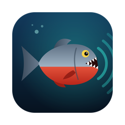

<p align="center">
  
</p>

<h1 align="center">Piranha</h1>

<p align="center"><strong>A native macOS app for WiFi sensing.</strong><br>
Presence, breathing, heart rate and pose from ESP32 CSI nodes, on your Mac.</p>

Piranha is a macOS application built on [RuView](https://github.com/ruvnet/RuView)
(MIT). It wraps RuView's node-management UI and its Rust sensing server in a
single `Piranha.app`: no Docker, no Python, no terminal.

| | |
|---|---|
| **Dashboard** | Live node and server status at a glance |
| **Discovery / Nodes** | Find ESP32 sensing nodes over mDNS + UDP |
| **Flash** | Serial firmware flashing wizard for ESP32-S3/C6 |
| **OTA** | Single-node and batch over-the-air updates |
| **Edge Modules** | Upload and manage WASM modules on nodes |
| **Sensing** | Start/stop the bundled sensing server, live logs and activity |
| **Mesh View** | Force-directed graph of the node mesh |

## Mac-native behaviour

- Universal binary (Apple Silicon + Intel), macOS 11 Big Sur or later
- Unified overlay title bar with traffic lights, full-screen support
- Standard menu bar: **Piranha** (About, Settings… `⌘,`, Hide, Quit), **Edit**,
  **View**, **Go** (`⌘1`…`⌘8` jump between pages), **Window**, **Help**
- Closing the window keeps Piranha in the Dock; click the Dock icon to bring it back
- The RuView `sensing-server` ships inside the bundle
  (`Piranha.app/Contents/MacOS/sensing-server`) and is stopped automatically on quit
- Local-network permission prompt and Bonjour declaration for node discovery
- Hardened runtime with explicit entitlements (`v2/crates/piranha/macos/Entitlements.plist`)
- Distributed as a drag-to-Applications `.dmg`

## Install

Download `Piranha_*.dmg` from the latest **Piranha macOS** workflow run (Actions →
Piranha macOS → artifacts) or from a `piranha-v*` release, open it and drag
**Piranha** into **Applications**.

The build is ad-hoc signed, not notarized. On first launch, right-click
Piranha.app → **Open**, or run:

```bash
xattr -dr com.apple.quarantine /Applications/Piranha.app
```

## Build from source

Requirements: macOS 11+, Xcode Command Line Tools, Rust (rustup), Node.js 20+.

```bash
git clone --recurse-submodules <this repo> piranha
cd piranha/v2/crates/piranha
./scripts/build-macos.sh            # universal (default)
./scripts/build-macos.sh arm64      # Apple Silicon only, faster
```

Output:

```
v2/target/<target>/release/bundle/macos/Piranha.app
v2/target/<target>/release/bundle/dmg/Piranha_0.1.0_<arch>.dmg
```

Development with hot reload (run `build-macos.sh` once first so the sidecar exists in `binaries/`):

```bash
cd v2/crates/piranha/ui && npm ci && npm run tauri dev
```

## Repository layout

| Path | What |
|---|---|
| `v2/crates/piranha/` | The app: Tauri v2 Rust shell, React UI, macOS bundle config |
| `v2/crates/piranha/tauri.macos.conf.json` | macOS window, DMG, signing and sidecar settings |
| `v2/crates/piranha/scripts/build-macos.sh` | One-shot build of the `.app` and `.dmg` |
| `v2/crates/wifi-densepose-sensing-server/` | RuView sensing server, bundled as the sidecar |
| `.github/workflows/piranha-macos.yml` | CI: checks + universal macOS build |
| everything else | Upstream RuView source; see [README.ruview.md](README.ruview.md) |

## Credits

Piranha is a repackaging of [ruvnet/RuView](https://github.com/ruvnet/RuView) by rUv,
used under the MIT License (see [LICENSE](LICENSE)). The upstream CI workflows are kept,
disabled, in `.github/workflows-upstream/`.
